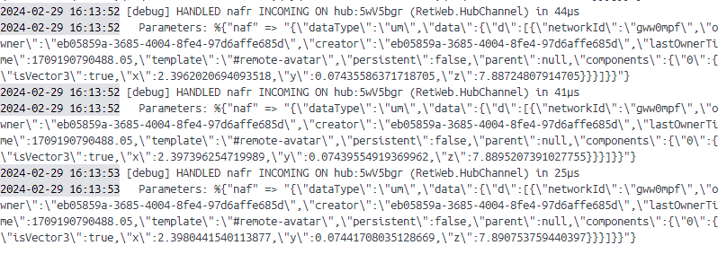
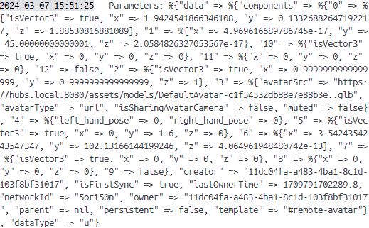

# Reticulumでユーザーの行動ログを取得する方法

## 目次
1. Reticulumのログをのぞいてみよう
1. 座標がブロードキャストされる流れ 
1. Reticulumを改造
1. 今後の課題
1. 参考にした資料リンクまとめ

## Reticulumのログをのぞいてみよう
### 移動や方向転換時に現れるログ

特に重要なのは以下の4つ
- **networkId**: hubs_idに相当する
- **owner**: session_idに相当する
- **template**: networkedAframeで定義されている3Dオブジェクトの種類
- **component**: 位置情報が格納されている
  
### 停止時または一定間隔で現れるログ
  
前に出現したcomponentが複数種類とそれに付随したデータ.現在わかっている限りでは**0はアバター本体,6は向いている方向**を表している

## 座標がブロードキャストされる流れ 
### クライアントサイド
**hub/src/phoenix-adapter.js 52行目**
```javascript
export default class PhoenixAdapter {

    // 一部省略

}

NAF.adapters.register("phoenix", PhoenixAdapter);
```
Reticulum用に拡張したnetworked-aframeオブジェクトを登録しておく

**hub/src/hub.js 561行目**
```javascript
function handleHubChannelJoined(entryManager, hubChannel, messageDispatch, data) {

    // 一部省略

　　scene.setAttribute("networked-scene", {
　　    room: hub.hub_id,
　　    serverURL: `wss://${hub.host}:${hub.port}`,
　　    debug: !!isDebug,
　　    adapter: "phoenix"
　　  });

    // 一部省略

}
```
入室すると,hundlleHubChannelJoined()が呼ばれる.そこでreticulumとdialogとの通信設定が行われる  
またWebSocket通信が確立し、さきほどログで見た情報がサーバーへ適宜送信される  

### サーバーサイド
**reticulum/lib/ret_web/channels/hub_channels.ex 41行目**
```elixir
def join("hub:" <> hub_sid, %{...} = params, socket) do

    # 一部省略

end
```
入室時hubチャネルに接続され,join()がコールされる.

**reticulum/lib/ret_web/channels/hub_channels.ex 152行目**
```elixir
# Captures all inbound NAF messages that result in spawned objects.
  def handle_in(
        "naf" = event,
        %{"data" => %{"isFirstSync" => true, "persistent" => false, "template" => template}} =
          payload,
        socket
      ) do
    data = payload["data"]

    if template |> spawn_permitted?(socket) do
      data =
        data
        |> Map.put("creator", socket.assigns.session_id)
        |> Map.put("owner", socket.assigns.session_id)

      payload = payload |> Map.put("data", data)

      broadcast_from!(
        socket,
        event |> internal_naf_event_for(socket),
        payload |> payload_with_from(socket)
      )

      {:noreply, socket}
    else
      {:noreply, socket}
    end
  end
```
ログで見せたインバウンドメッセージを受け取る関数

**reticulum/deps/phx/lib/pxh/logger.ex 361行目**
```elixir
def phoenix_channel_handled_in(_, %{duration: duration}, %{socket: socket} = metadata, _) do
    channel_log(:log_handle_in, socket, fn ->
      %{event: event, params: params} = metadata

      [
        "HANDLED ",
        event,
        " INCOMING ON ",
        socket.topic,
        " (",
        inspect(socket.channel),
        ") in ",
        duration(duration),
        "\n  Parameters: ",
        inspect(filter_values(params))
      ]
    end)
end
```
ログのフォーマットはPhowenixモジュールで定義されている. loggerモジュールを拡張したもの

## Reticulumを改造
### (1) 外部モジュールを追加
使用するモジュール
<dl>
  <dt>- <a href="https://github.com/mobileoverlord/phoenix_client">PhoenixClient</a></dt>
  <dd>PhoenixChannelに接続するクライアント用モジュール</dd>
  <dt>- Registry</dt>
  <dd>オンメモリKVSを提供する標準モジュール. ログを出力するプロセスが1ルーム1つになるよう管理する</dd>
  <dt>- DynamicSupervisor</dt>
  <dd>動的にプロセスを起動し管理してくれる標準モジュール</dd>
</dl>

**reticulum/mix.ex**を編集
```elixir
defp deps do

  # 一部省略

  #追加
  {:phoenix_client, "~> 0.3"} 
end
```
外部モジュールをインストール
```bash
$ mix deps.get 
```

### (2) WebSocket通信の準備
**reticulum/lib/ret/application.ex**を編集
```elixir
defmodule Ret.Application do
  use Application

  import Cachex.Spec, only: [expiration: 1, fallback: 1, warmer: 1]

  def start(_type, _args) do
  
  # 一部省略

  ws_opt = [url: "wss://hubs.local:4000/socket/websocket?vsn=2.0.0"]
    children = [

      # 一部省略

      #追加
      {DynamicSupervisor, name: Ret.YukitSupervisor, strategy: :one_for_one},
      {PhoenixClient.Socket, {ws_opt, name: PhoenixClient.Socket}},
      {Registry, keys: :unique, name: Ret.YukitRegistry},
    ]
  end

  def config_change(changed, _new, removed) do
    RetWeb.Endpoint.config_change(changed, removed)
    :ok
  end
end
```

### (3) 行動ログをファイル出力するプロセスを作成
**reticulum/lib/ret/yukit_worker.ex**を作成
```elixir
defmodule Ret.YukitWorker do
  use GenServer, restart: :temporary
  alias PhoenixClient.{Socket}

  def start_link({hub_sid}) do
    name = {:via, Registry, {Ret.YukitRegistry, "#{hub_sid}"}}
    GenServer.start_link(__MODULE__, {hub_sid}, name: name)
  end

  # DynamicSupervisorにより起動される
  def init({hub_sid}) do
    {:ok, file} = File.open("./logs/#{hub_sid}.log", [:write, :delayed_write])
    {:ok, _res, _channel} = PhoenixClient.Channel.join(
      Socket,
      "hub:#{hub_sid}",
      %{"profile" => "yukit_worker"}
    )
    {:ok, file}
  end

  # トピック内で発生するすべてのメッセージを非同期でキャッチ
  def handle_info(msg, file) do
    IO.write(file, "#{inspect(msg)}\n")
    {:noreply, file}
  end
end
```

### (4) 作成したプロセスをトピックにjoinさせ起動
**reticulum/lib/ret_web/channels/hubs_channel.ex**を編集
```elixir
defmodule RetWeb.HubChannel do
  
  # 一部省略

  #追加
  def join("hub:" <> hub_sid, %{"profile" => "yukit_worker"} = _params, socket) do
    socket
    |> assign(:hub_sid, hub_sid)
    {:ok, %{}, socket}
  end

  # 一部省略

  defp join_with_hub(%Hub{} = hub, account, socket, context, params) do

    # 一部省略

    #追加
    if Registry.lookup(Ret.YukitRegistry, hub.hub_sid) == [] do
        {:ok, _} = DynamicSupervisor.start_child(Ret.YukitSupervisor, {Ret.YukitWorker, {hub.hub_sid}})
    end

    {:ok, response, socket}
  end
end

```

### (5) 実行
コード変更後再起動すると, logsディレクトリに{hubs_id}.logというファイルが作成される


## 今後の課題
- ルーム内に人がいないときはYukitWorkerを停止し,以降は一人目の入出のたびに起動するようにする
- ログに出力するメッセージのフィルタリング及び整形
- 集めたログファイルたちのバッチ処理を検討


## 参考にした資料リン集まった